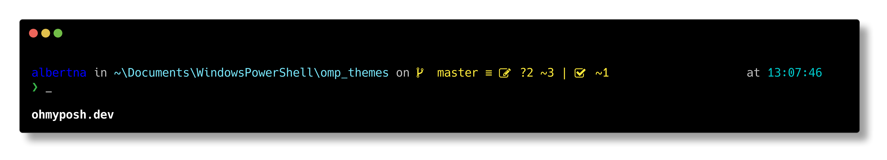
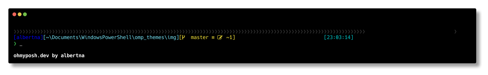

# My Oh-My-Posh themes

## Fluent theme



## Blocks theme



## Usage

In `Microsoft.Powershell_profile.ps1`:

```Powershell
$env:VIRTUAL_ENV_DISABLE_PROMPT=1

Import-Module PSReadLine
Set-PSReadLineOption -PredictionSource HistoryAndPlugin

Import-Module posh-git
$env:POSH_GIT_ENABLED = $true
# $GitPromptSettings.BeforeStatus = ''
# $GitPromptSettings.AfterStatus = ''

oh-my-posh init pwsh --config '~/Documents/WindowsPowerShell/my-omp-themes/fluent.json' | Invoke-Expression
# Enable-PoshTransientPrompt
```
